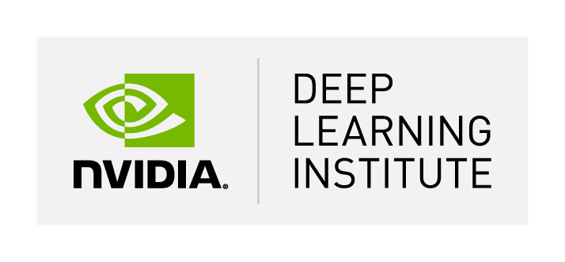
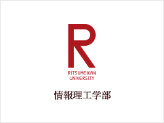

## Fundamentals of Deep Learning Workshop, an NVIDIA Deep Learning Institute（DLI）Certified Course 
### Date and Time: 
13:00-22:00 December 10, 2022 (JST)
### Place: 
Zoom (to be announced to registered participants)
### Content: 
See the content of this <a href="https://www.nvidia.com/en-us/training/instructor-led-workshops/fundamentals-of-deep-learning/" target="_blank">NVIDIA DLI page</a> (Upon successful completion of the assessment, participants will receive an NVIDIA DLI certificate like <a href="https://learn.next.courses.nvidia.com/certificates/29591b570cdb4b8bb0b0ea7259e9ab83" target="_blank">this</a>.)
### Expected Number of Participants: 
40 (first-come-first-served basis among students with the following qualifications)
### Prerequisites: 
<ins>Third-year undergraduate students and above or graduate students</ins> who:
1. **Required:** have an understanding of fundamental programming concepts in Python 3, such as functions, loops, dictionaries, and arrays
2. **Recommended:** have familiarity with Pandas data structures and an understanding of how to compute a regression line
3. **Required:** are able to participate in the entire workshop
### Network Environment and Hardware Requirements: 
Desktop or laptop computer capable of running the latest version of Chrome or Firefox as well as a network environment able to provide stable access to a GPU-accelerated server, provided by NVIDIA DLI, in the cloud.
### Free Registration (open until 09:00 AM December 3 (JST), 2022): 
Please register on this Microsoft Forms <a href="https://forms.office.com/r/yP8z2g3QDm" target="_blank">page</a>. (RU students only) 
### Instructor: 
<a href="http://www.ice.ci.ritsumei.ac.jp/~ruck/" target="_blank">Ruck Thawonmas</a> , <a href="http://en.ritsumei.ac.jp/ise/">College of Information Science and Engineering</a> 
### Prospective TAs:
 * <a href="https://courses.nvidia.com/certificates/0e3d9ba247494a8daf6b1819c72cddc0/" target="_blank">Fajar Dewantoro Mury</a>
 * <a href="https://learn.next.courses.nvidia.com/certificates/9ad2afd826a345c189dde58002e448d8" target="_blank">Febri Abdullah</a>
 * <a href="https://courses.nvidia.com/certificates/a9a74b24e5c14a50a147ad43e6367e3c/" target="_blank">Ibrahim Khan</a>
 * <a href="https://courses.nvidia.com/certificates/d375942c39f34c1eae3856bdc542ffc1/" target="_blank">Roman Savchyn</a>
 * <a href="https://courses.nvidia.com/certificates/86b2b72915684ed9b3f5cb32b8949871/" target="_blank">Yushi Liu</a>
### Sponsors：

### [Contact Us](mailto:dli-ws@ice.ci.ritsumei.ac.jp)
------------------------------------------------------------------------

