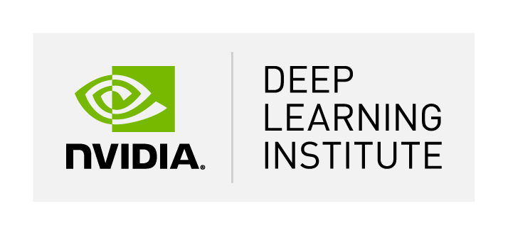

## NVIDIA Deep Learning Institute（DLI）認定コース ディープラーニングの基礎 @ Zoom
### 日時：2022年9月24日（土）9:00-18:00
### 内容：<a href="https://www.nvidia.com/ja-jp/training/instructor-led-workshops/fundamentals-of-deep-learning/" target="_blank">このNVIDIAページ記載内容に準じる</a>
### 受講者規模：40 名程度（以下の受講資格を有する学生で先着順）
### 受講資格：「関数，ループ，辞書，配列など，Python の基礎的なプログラミング概念, 及び回帰直線を計算する方法を理解している」学部３回生以上か大学院生，かつ「ワークショップの全行程に参加できること」
### 受講登録（準備中）：<a href="" target="_blank">（学内の方のみ，定員オバーの場合は先着順）</a> 
### 講師：<a href="http://www.ice.ci.ritsumei.ac.jp/~ruck/" target="_blank">情報理工学部 ターウォンマット　ラック</a> 
### TA・ES予定者：
 * <a href="https://learn.next.courses.nvidia.com/certificates/8b6163a105a64f878368380ed20e4958" target="_blank">田邉 准 (TA)</a>
 * <a href="" target="_blank">YU Lian (TA)</a>
 * <a href="https://courses.nvidia.com/certificates/89ae39d63ede471c802c18aa96423b4f/" target="_blank">長谷川 稜介 (ES)</a>
 * <a href="" target="_blank">ZHAO Shuang (ES)</a>
### 協賛：
 
 

------------------------------------------------------------------------
